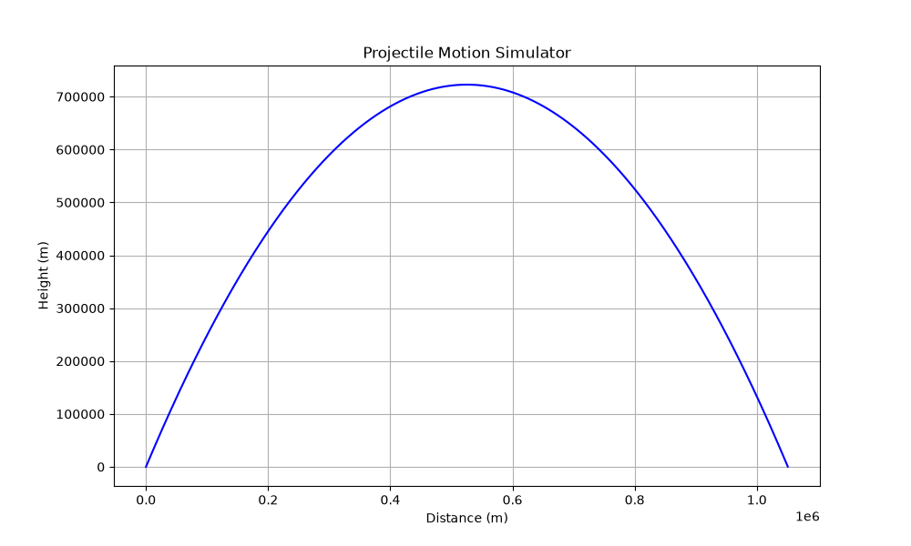

# Projectile-motion-simulator
A Python simulator of projectile  motion using real physics and trigonometry.

## What it does
-User inputs launch speed and angle
-Calculates horizontal and vertical motion separately
-Shows maximum distance and maximum height
-Generates a trajectory graph

## Physics used
- Trigonometry: vx = speed x cos(angle), vy = speed x sin(angle)
- Gravity pulls the projectile down every second: vy = vy - 9.8
- Horizontal speed stays constant (no air resistance)

## Example Results 
- Speed:4000 m/s, Angle: 70 -> Distance: 1050 km, Height: 722 km

## Technologies
- Python 3
- Matplotlib
- Mat library

## How to run 
Enter launch speed and angle when prompted.

## Author 
Built by Mark Khachaturyan as part of my engineering portfolio
